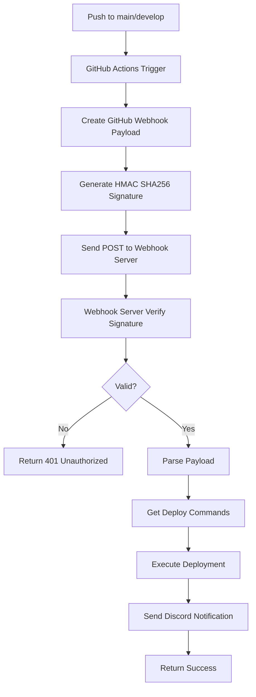

# 🚀 Webhook Deployment Setup Guide

## 📋 Tổng quan

Hướng dẫn cấu hình GitHub Actions để tự động deploy qua webhook server theo chuẩn WEBHOOK_CI_CD_GUIDE.md.

## 🔧 Cấu hình GitHub Secrets

### 1. Thêm GitHub Secrets
Vào **Settings → Secrets and variables → Actions** của repository và thêm:

```bash
# Required secrets
WEBHOOK_SECRET=your_webhook_secret_here
WEBHOOK_URL=https://webhook1.iceteadev.site/deploy

# Optional secrets (nếu khác default)
# WEBHOOK_URL=https://your-webhook-server.com/deploy
```

### 2. Cấu hình Environment Variables trên Webhook Server

Theo chuẩn WEBHOOK_CI_CD_GUIDE.md, webhook server cần có:

```bash
# Cấu hình cơ bản
PORT=8300
WEBHOOK_SECRET=your_webhook_secret_here
DISCORD_WEBHOOK=https://discord.com/api/webhooks/...

# Cấu hình global
WORK_DIR=/opt/projects

# Cấu hình cho repository này
# Format: DEPLOY_COMMANDS_OWNER_REPO_NAME
DEPLOY_COMMANDS_TUANPHAM2XX3_MRS_ADDRESS_BE="git pull origin main;go mod tidy;go build -o mrs_address_be;sudo systemctl restart mrs_address_be"

# Working directory cho repository này
WORK_DIR_TUANPHAM2XX3_MRS_ADDRESS_BE="/opt/mrs_address_be"
```

## 🔐 Signature Verification

### Workflow sử dụng chuẩn GitHub webhook signature:

1. **Payload format**: GitHub webhook standard format
2. **Signature**: `X-Hub-Signature-256: sha256=HASH`
3. **Algorithm**: HMAC SHA256 với secret
4. **Headers**: Chuẩn GitHub webhook headers

### Debug signature issues:

```bash
# Test signature generation local
WEBHOOK_SECRET="your_secret"
PAYLOAD='{"ref":"refs/heads/main","repository":{"name":"test"}}'
echo -n "$PAYLOAD" | openssl dgst -sha256 -hmac "$WEBHOOK_SECRET" | cut -d' ' -f2
```

## 🎯 Workflow Triggers

### Automatic triggers:
- **Push to main**: Production deployment
- **Push to develop**: Staging deployment

### Manual triggers:
- **workflow_dispatch**: Chọn environment (staging/production)

## 📊 Monitoring & Logs

### GitHub Actions logs sẽ hiển thị:
- Webhook payload
- Signature generation
- HTTP response từ webhook server
- Deployment status

### Webhook server logs sẽ có:
- Signature verification
- Deployment commands execution
- Discord notifications

## 🔍 Troubleshooting

### Common Issues:

#### 1. **Signature Verification Failed (401)**
```bash
# Kiểm tra:
- WEBHOOK_SECRET trong GitHub secrets khớp với webhook server
- Payload format đúng chuẩn GitHub webhook
- Webhook server implement signature verification đúng
```

#### 2. **No Deploy Commands (No Action)**
```bash
# Kiểm tra environment variable trên webhook server:
DEPLOY_COMMANDS_TUANPHAM2XX3_MRS_ADDRESS_BE="your_commands_here"
```

#### 3. **Working Directory Not Found**
```bash
# Kiểm tra path exist trên server:
WORK_DIR_TUANPHAM2XX3_MRS_ADDRESS_BE="/opt/mrs_address_be"
```

#### 4. **Webhook Server Not Responding**
```bash
# Test webhook server:
curl -X POST https://webhook1.iceteadev.site/deploy \
  -H "Content-Type: application/json" \
  -d '{"test": "connectivity"}'
```

## 🚀 Deployment Commands Examples

### Go API Server:
```bash
DEPLOY_COMMANDS_TUANPHAM2XX3_MRS_ADDRESS_BE="git pull origin main;go mod tidy;go test ./...;go build -o mrs_address_be;sudo systemctl restart mrs_address_be"
```

### With Docker:
```bash
DEPLOY_COMMANDS_TUANPHAM2XX3_MRS_ADDRESS_BE="git pull origin main;docker build -t mrs_address_be .;docker stop mrs_address_be || true;docker run -d --name mrs_address_be -p 8100:8100 mrs_address_be"
```

### With PM2:
```bash
DEPLOY_COMMANDS_TUANPHAM2XX3_MRS_ADDRESS_BE="git pull origin main;npm ci;npm run build;pm2 restart mrs_address_be"
```

## 📝 Testing Workflow

### 1. Test Manual Deployment:
```bash
# Vào Actions → Webhook Deployment → Run workflow
# Chọn environment và trigger
```

### 2. Test Automatic Deployment:
```bash
# Push code to main branch
git add .
git commit -m "test deployment"
git push origin main
```

### 3. Monitor Deployment:
```bash
# Check GitHub Actions logs
# Check webhook server logs
# Check Discord notifications
# Test API endpoint
```

## 🔄 Workflow Process



## 🎨 Customization

### Modify deployment commands:
```bash
# Edit environment variables on webhook server
DEPLOY_COMMANDS_OWNER_REPO_NAME="custom_command1;custom_command2"
```

### Change webhook URL:
```bash
# Update GitHub secret
WEBHOOK_URL=https://your-new-webhook-server.com/deploy
```

### Add health check:
```bash
# Update health URLs in workflow
HEALTH_URL="https://your-api.com/health"
```

## 📞 Support

### Debug checklist:
1. ✅ GitHub secrets configured
2. ✅ Webhook server running
3. ✅ Environment variables set
4. ✅ Deploy commands configured
5. ✅ Working directory exists
6. ✅ Permissions correct
7. ✅ Discord webhook configured

### Files to check:
- `.github/workflows/webhook-deploy.yml`
- Webhook server signature verification
- Environment variables trên VPS
- Discord webhook configuration

---

**🎯 Mục tiêu**: Tự động deploy code khi push without manual intervention, với signature verification an toàn theo chuẩn GitHub webhook. 